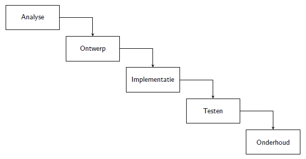

Documentatie S2 Software Demand Based
=====================================

Software engineering is een integraal proces waarbij vanuit een  probleemomschrijving een passend product opgeleverd wordt. De grootste uitdaging hierbij is duidelijk krijgen wat er precies ontwikkeld moet worden en daarnaast borgen dat hetgeen dat ontwikkeld is, juist is. 

Hierbij betekent “juist” niet alleen dat de opgeleverde applicatie werkt maar ook dat deze voldoet aan de eisen van het project: het programma doet wat het moet doen.

In figuur 1 is het traditionele watervalmodel te zien wat ook vandaag de dag nog vaak gebruikt wordt binnen softwareontwikkeling. 

Merk op dat deze cyclus vaak meermaals doorlopen wordt: het is geen vereiste om voor de gehele applicatie een complete analyse en ontwerp op te stellen alvorens er begonnen wordt met de implementatie. Doorgaans wordt een applicatie opgedeeld in meerdere iteraties, waarbij per iteratie grofweg dit traject doorlopen wordt.

<figure>
    
    <figcaption>Figuur 1: Verschillende activiteiten in softwareontwikkeling: Analyse, Ontwerp, Implementatie, Testen, Onderhoud</figcaption>
</figure>

In de werkelijkheid zijn procesmodellen doorgaans niet zo simplistisch als hier weergegeven.
Het geschetste plaatje biedt echter een mooie kapstok om de activiteiten die per fase gedaan
worden van een toelichting te voorzien. Het uiteindelijke doel van dit document is het toelichten van de visie op het softwareontwikkelproces. Hierbij wordt context gegeven aan de hand van voorbeelden; deze voorbeelden zijn niet de enig mogelijke of correcte manier om dit te doen: deze dienen puur als beeldvorming.

### Inhoudsopgave
1. [Projectmethodiek](Onderwerpen\Methodiek)
2. Activiteiten
   * [Use-cases](Onderwerpen\UseCases)
   * 

